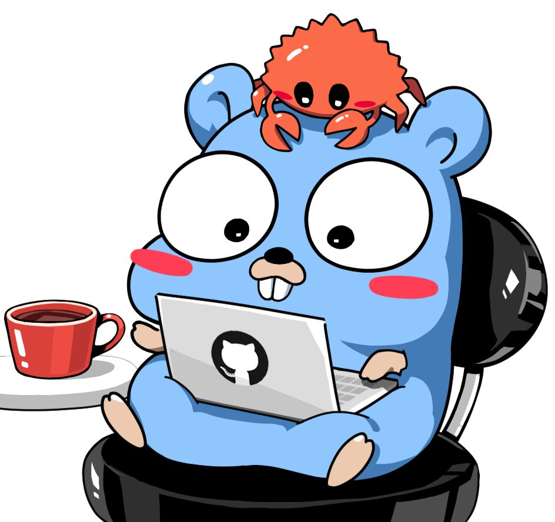

<h2>Hi, welcome </h2>
<!--

-->
<p align="left" > I'm <b>FabianMolinaB</b> software developer in Colombia 🇨🇴
  
-  I’m currently learning <b>Go.</b>
- 🧐 Interested in full stack and critical philosophy.
- 👏 I’m looking to collaborate on Clan Sports.
- 🥺 I like exploring <b>GNU/Linux and NeoVim.</b>
- 🎮 In my spare time play battle royales.
- I 🤎 coffe.

<h2>About me </h2>

```tsx
  
  export const AboutMe: React.FC = () => {
  
    const myTools = {
      ProgrammigLenguajes: {'Javascript', 'Typescript', 'Go', 'Python'},
      FrontEnd: {'React', 'Next', 'Astro', 'Redux', 'Storybook' 'Tailwind'},
      BackEnd: {'Node', 'SQL', 'MySQL', 'Firebase', 'MongoDB'},
      Editors: {'NeoVim'},
      OperatingSystem: {'GNU/Linux'}
    }
  
  return (
      <h1>My Tools</h1>
      {
        Object.entries(myTools).forEach(([key, value]) => {
          console.log(value)
        })
      }
    )
}
```
  
<h2> Statistics</h2>
<p>
  
</p>  
<h2 align="left">Contact me: </h2>
<p align="left">
<a href="https://twitter.com/fabianmolinab" target="blank"></a>
<a href="https://linkedin.com/in/fabianmolinab" target="blank"></a>
<a href="https://medium.com/@fabianmolinab" target="blank"></a>
</p>
